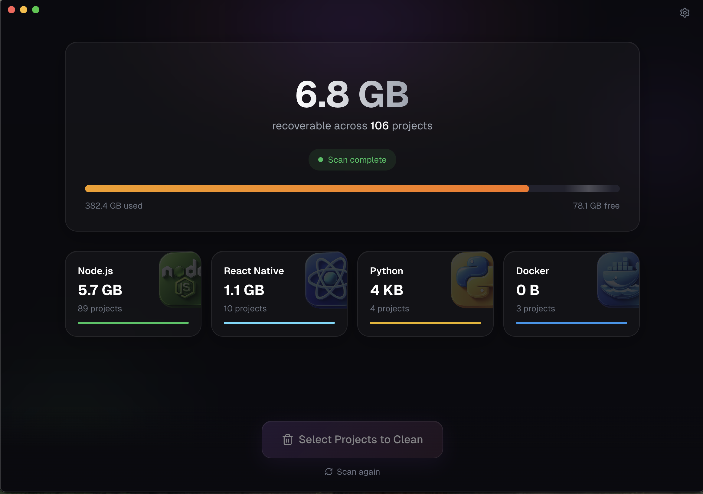

<p align="center">
  
</p>

<h1 align="center">Cluttered</h1>

<p align="center">
  <strong>A beautiful, addictive disk cleaner for developers</strong>
</p>

<p align="center">
  <a href="https://github.com/gatteo/cluttered/releases/latest">
    
  </a>
  <a href="https://github.com/gatteo/cluttered/blob/main/LICENSE">
    
  </a>
  <a href="https://github.com/gatteo/cluttered/stargazers">
    
  </a>
</p>

<p align="center">
  <a href="#features">Features</a> •
  <a href="#installation">Installation</a> •
  <a href="#supported-ecosystems">Ecosystems</a> •
  <a href="#how-it-works">How It Works</a> •
  <a href="#development">Development</a>
</p>

---

## What is Cluttered?

Cluttered is a macOS app that helps developers reclaim disk space by safely cleaning build artifacts, dependency caches, and other regenerable files from development projects.

Ever wondered where your disk space went? Chances are, it's hiding in:

- `node_modules` folders (often 500MB+ each)
- Rust `target/` directories (can be multiple GB)
- Python virtual environments
- Xcode DerivedData
- And many more...

Cluttered finds all these across your machine and lets you clean them safely.

<p align="center">
  
</p>

## Features

- **Multi-ecosystem support** - Node.js, Python, Rust, Go, Xcode, Android, and more
- **Smart protection** - Won't delete projects with uncommitted git changes
- **Activity-based classification** - See which projects are active vs dormant
- **Safe by default** - Moves to Trash (recoverable) instead of permanent deletion
- **Fast scanning** - Efficiently scans your entire home directory
- **Beautiful UI** - Native macOS app with smooth animations

## Supported Ecosystems

| Ecosystem | Detected By | Cleanable Artifacts |
|-----------|-------------|---------------------|
| **React Native** | `package.json` + `ios/` or `android/` | `node_modules`, `ios/Pods`, `ios/build`, `android/build`, `.expo` |
| **Node.js** | `package.json` | `node_modules`, `.next`, `.nuxt`, `dist`, `build`, `.turbo`, `.cache` |
| **Rust** | `Cargo.toml` | `target/` |
| **iOS / Xcode** | `*.xcodeproj` | `DerivedData`, `build/` |
| **Android** | `build.gradle` | `build/`, `.gradle` |
| **Python** | `requirements.txt`, `pyproject.toml` | `__pycache__`, `.venv`, `venv`, `.pytest_cache` |
| **Go** | `go.mod` | `vendor/` |
| **Docker** | `Dockerfile` | Detection only |
| **Ruby** | `Gemfile` | `vendor/bundle` |
| **PHP** | `composer.json` | `vendor/` |
| **Java** | `pom.xml`, `build.gradle` | `target/`, `build/` |
| **Elixir** | `mix.exs` | `deps/`, `_build/` |
| **.NET** | `*.csproj` | `bin/`, `obj/` |

## Installation

### Download

Download the latest release from [GitHub Releases](https://github.com/gatteo/cluttered/releases/latest).

- **Apple Silicon (M1/M2/M3)**: `Cluttered-x.x.x-arm64.dmg`
- **Intel Mac**: `Cluttered-x.x.x-x64.dmg`

### Homebrew (coming soon)

```bash
brew install --cask cluttered
```

### Requirements

- macOS 12.0 (Monterey) or later
- ~50MB disk space

## How It Works

### Scanning

1. Cluttered walks through your configured directories (default: home folder)
2. For each folder, it checks if it's a project root for any supported ecosystem
3. When a project is found, it analyzes:
   - Total size of cleanable artifacts
   - Last modification date
   - Git status (uncommitted changes)
   - Whether it's currently open in an IDE

### Project Classification

Projects are classified by activity level:

| Status | Description | Default Threshold |
|--------|-------------|-------------------|
| **Active** | Recently worked on | Last 7 days |
| **Recent** | Moderate activity | 7-30 days |
| **Stale** | Low activity | 30-90 days |
| **Dormant** | Inactive | 90+ days |

### Protection

Cluttered protects your work:

- **Uncommitted changes** - Projects with uncommitted git changes are protected
- **Active projects** - Recently modified projects show a warning
- **Protected paths** - Mark folders as never-clean
- **Trash by default** - Files go to Trash and can be recovered

## Development

### Prerequisites

- Node.js 18+
- pnpm

### Setup

```bash
# Clone the repository
git clone https://github.com/gatteo/cluttered.git
cd cluttered

# Install dependencies
pnpm install

# Run in development mode
pnpm dev

# Build for production
pnpm build

# Package the app
pnpm package
```

### Project Structure

```
cluttered/
├── src/
│   ├── main/           # Electron main process
│   │   ├── services/   # Core business logic
│   │   ├── ecosystems/ # Ecosystem plugins
│   │   ├── database/   # SQLite persistence
│   │   └── ipc/        # IPC handlers
│   ├── renderer/       # React UI
│   │   ├── pages/      # Page components
│   │   ├── components/ # Reusable UI
│   │   └── store/      # Zustand state
│   └── shared/         # Shared types
└── assets/             # Icons, sounds
```

See [ARCHITECTURE.md](./ARCHITECTURE.md) for detailed technical documentation.

## Contributing

We welcome contributions! Please see [CONTRIBUTING.md](./CONTRIBUTING.md) for guidelines.

### Ways to Contribute

- Report bugs and request features via [Issues](https://github.com/gatteo/cluttered/issues)
- Submit pull requests for bug fixes or new features
- Add support for new ecosystems
- Improve documentation

## License

MIT License - see [LICENSE](./LICENSE) for details.

## Acknowledgments

Built with:

- [Electron](https://www.electronjs.org/)
- [React](https://react.dev/)
- [Tailwind CSS](https://tailwindcss.com/)
- [Zustand](https://zustand-demo.pmnd.rs/)
- [Framer Motion](https://www.framer.com/motion/)
- [better-sqlite3](https://github.com/WiseLibs/better-sqlite3)

---

<p align="center">
  Made with care for developers
</p>
